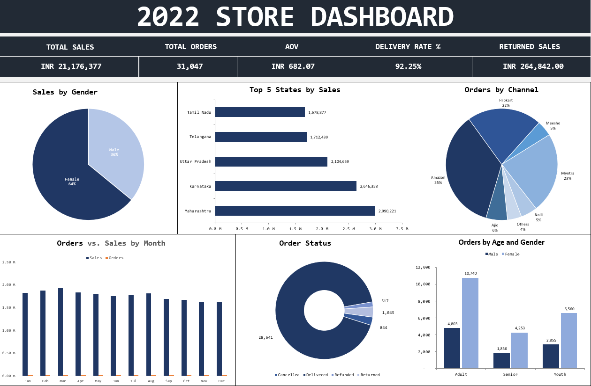
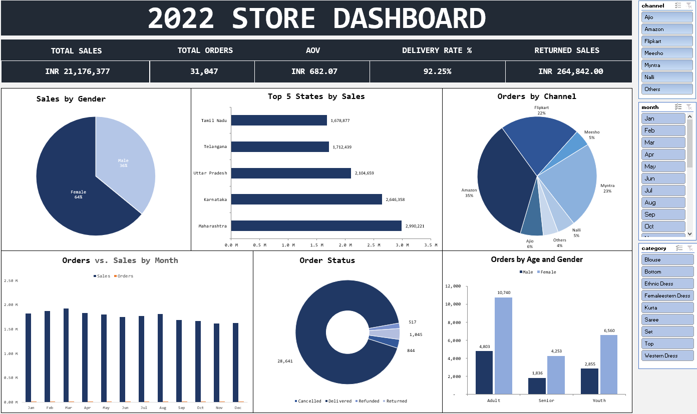

# 📊 Clothing Store Annual Sales Analysis & Dashboard

## 📌 Executive Summary
This project analyzes a clothing store’s 2022 sales performance using Microsoft Excel. The objective was to transform raw transactional data into a dynamic, interactive dashboard that provides actionable business insights. The analysis identifies key customer demographics, geographic sales distribution, and high-performing sales channels to drive future marketing strategies.

---

## 🛠️ Data Pipeline & Methodology
To ensure accurate reporting, the dataset underwent a rigorous cleaning and processing phase before visualization.

**1. Data Cleaning & Standardization:**
* Identified and handled missing values across 31,000+ records.
* Standardized formatting for categorical variables (e.g., standardizing text case, correcting spelling inconsistencies in state names/channels).
* Created new calculated columns (e.g., grouping ages into 'Youth', 'Adult', and 'Senior' categories) to facilitate demographic analysis.

**2. Data Processing & Aggregation:**
* Utilized complex formulas, VLOOKUP/XLOOKUP, and conditional formatting to structure the data.
* Built robust Pivot Tables and Pivot Charts to aggregate KPIs across different dimensions (Time, Geography, Demographics).

**3. Dashboard Creation:**
* Designed an interactive, single-page dashboard utilizing Slicers to allow stakeholders to filter data dynamically by month, channel, and category.

---

## 📈 Key Performance Indicators (KPIs)

| Metric | Performance |
| :--- | :--- |
| 💰 **Total Sales Revenue** | ₹21,176,377 |
| 📦 **Total Orders Processed** | 31,047 |
| 🛒 **Average Order Value (AOV)** | ₹682.07 |
| ✅ **Successful Delivery Rate** | 92.25% |
| ↩️ **Value of Returned Sales** | ₹264,842 |

---

## 💡 Actionable Business Insights

| Focus Area | Key Finding | Strategic Recommendation |
| :--- | :--- | :--- |
| 🎯 **Demographic Targeting** | Adult females are the primary consumer base, contributing to **64%** of total sales volume (10,740 orders). | Allocate a larger portion of the marketing budget toward campaigns targeting adult women. |
| 🗺️ **Geographic Expansion** | Maharashtra is the highest-performing region, generating nearly **₹3M** in revenue, followed closely by Karnataka and Uttar Pradesh. | Optimize supply chain logistics and localized promotions in these top 3 states. |
| 🛍️ **Channel Optimization** | Amazon (35%) and Myntra (23%) dominate as the most profitable sales channels. | Negotiate better commission rates with these platforms or run exclusive flash sales to maximize AOV. |
| 📅 **Seasonal Trends** | Sales peaked significantly during March and April, with a noticeable dip in the following months. | Implement retention campaigns or mid-year discount events to stabilize revenue during off-peak months. |

---

## 🖥️ Dashboard Preview
*(The interactive dashboard allows filtering by Month, Channel, and Order Status)*

---

## 📂 Repository Contents
* `data/`: Contains both the raw transactional dataset and the cleaned data used for analysis.
* `clothing_store_insights.xlsx`: The complete Excel workbook containing the raw data, working sheets, pivot tables, and the final dashboard.
* `assets/`: Contains visual assets like dashboard screenshots.
