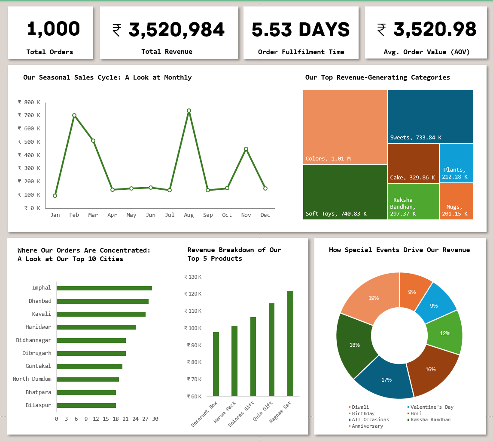

# 🌸 Ferns and Petals Sales Analysis & Dashboard

  

## 📌 Executive Summary
This project explores the **Ferns and Petals** e-commerce dataset to analyze sales performance, order fulfillment efficiency, and seasonal revenue trends. The objective was to transform raw transactional data into a dashboard that visualizes product category success, geographic order distribution, and the impact of special events on customer purchasing behavior. 

---

## 🛠️ Data Processing & Methodology
To ensure accurate reporting and dynamic visualization, the raw data across multiple sources was structured and processed using **Power Query** before being loaded into the final dashboard.

**1. Data Extraction & Modeling:**
* Imported raw relational datasets (`orders.csv`, `products.csv`, and `customers.csv`) into Excel using Power Query.
* Created a unified data model by establishing relationships between orders, product details, and customer demographics.

**2. Data Cleaning & Aggregation:**
* Utilized Power Query to calculate custom metrics, such as the **Order Fulfillment Time** (the difference between order placement and delivery dates).
* Built targeted Pivot Tables to aggregate total revenue by month, special event categories, and city distribution.

**3. Dashboard Architecture:**
* Designed a centralized dashboard featuring key performance scorecards, a line graph for seasonal tracking, a treemap for category revenues, and donut/bar charts for categorical distributions.
* Ensured data visuals reflect precise currency formatting (₹) and proportional distributions for quick executive insights.

## 📈 Key Performance Indicators (KPIs)

| Metric | Performance |
| :--- | :--- |
| 📦 **Total Orders** | 1,000 |
| 💰 **Total Revenue** | ₹ 3,520,984 |
| 🚚 **Order Fulfillment Time** | 5.53 Days |
| 💳 **Avg. Order Value (AOV)** | ₹ 3,520.98 |

## 💡 Key Sales Insights

| Focus Area | Key Finding | Insight / Trend |
| :--- | :--- | :--- |
| 📅 **Seasonal Sales Cycle** | Revenue spikes drastically in **February** (₹ 700K) and **August** (₹ 730K), with a moderate peak in November. | Sales are heavily driven by cultural and romantic milestones (e.g., Valentine's Day prep in Feb, Raksha Bandhan in Aug, and Diwali in Nov). |
| 🛍️ **Top Categories** | **Colors (₹ 1.01 M)**, **Soft Toys (₹ 740.83 K)**, and **Sweets (₹ 733.84 K)** are the dominant revenue generators. | Customers are prioritizing traditional festive gifts and physical keepsakes over secondary items like plants or standard mugs. |
| 🎉 **Event-Driven Revenue** | **Anniversaries (19%)** and **Raksha Bandhan (18%)** are the most lucrative special events, closely followed by All Occasions (17%) and Holi (16%). | While major holidays drive sharp seasonal spikes, personal milestones like anniversaries provide a strong, consistent baseline of revenue throughout the year. |
| 📍 **Geographic Concentration** | **Imphal** and **Dhanbad** lead as the top two cities for order volume, followed closely by Kavali and Haridwar. | The brand has a strong foothold in emerging Tier-2 and Tier-3 cities, indicating successful regional market penetration. |

---

## 🖥️ Dashboard Preview

---

## 📂 Repository Contents
* `Ferns and Petals.xlsx`: The complete Excel workbook containing the Power Query connections, data models, Pivot Tables, and the final interactive dashboard.
* `orders.csv`: Raw dataset containing transactional order history and dates.
* `products.csv`: Raw dataset containing product catalog details, categories, and pricing.
* `customers.csv`: Raw dataset containing customer demographics and geographic data.