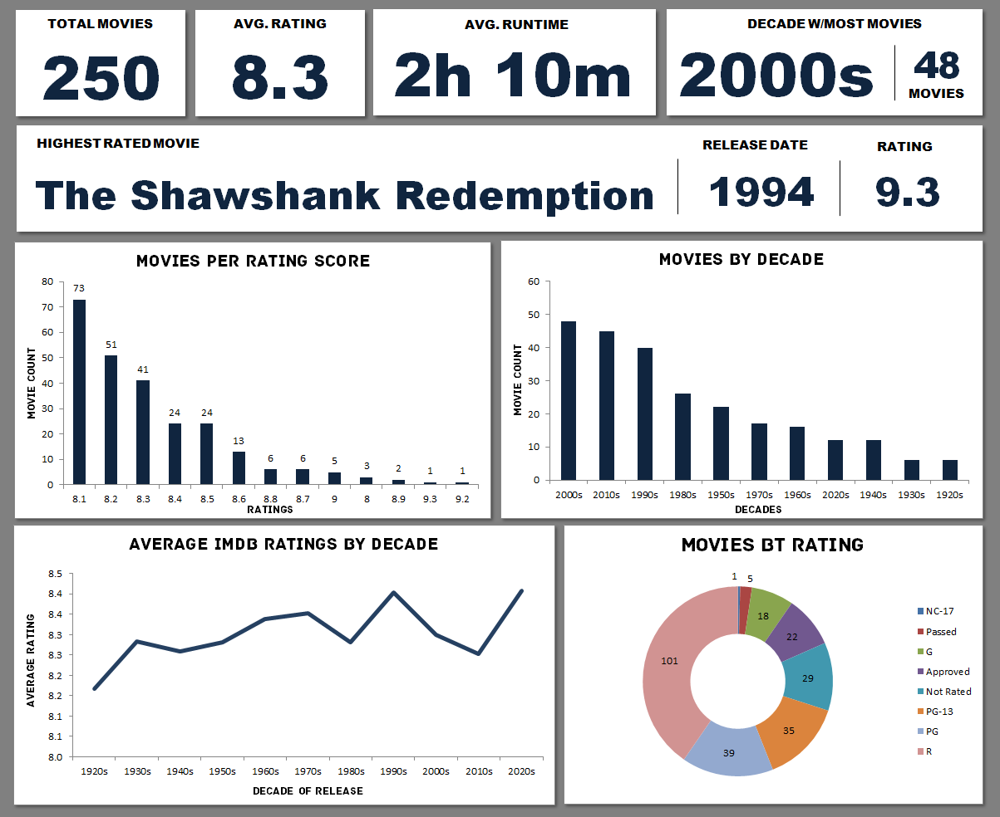

# 🎬 IMDb Top 250 Movies Analysis & Dashboard

## 📌 Executive Summary
This project explores the **IMDb Top 250 Movies** dataset to analyze audience ratings, runtimes, and historical trends in cinema. The objective was to transform raw movie statistics into an interactive dashboard that visualizes how critically acclaimed films are distributed across different decades, maturity ratings, and score brackets. 

---

## 🛠️ Data Processing & Methodology
To ensure accurate reporting and dynamic visualization, the dataset was structured and processed before being loaded into the dashboard.

**1. Data Cleaning & Standardization:**
* Extracted and standardized release years into structured "Decade" groupings (e.g., 1990s, 2000s) to facilitate historical trend analysis.
* Converted raw text string runtimes (e.g., "2h 22m") into uniform numerical minute values (e.g., 142) for accurate mathematical aggregation.

**2. Aggregation & Metrics Calculation:**
* Built targeted Pivot Tables to evaluate the volume of top movies per decade and their average corresponding scores.
* Calculated overall cinematic KPIs, such as the exact mean runtime and rating across all 250 films.

**3. Dashboard Architecture:**
* Built a centralized, dashboard featuring KPI scorecards, line graphs for historical tracking, and bar/donut charts for categorical distributions.

---

## 📈 Key Performance Indicators (KPIs)

| Metric | Performance |
| :--- | :--- |
| 🎞️ **Total Movies Analyzed** | 250 |
| ⭐ **Average IMDb Rating** | 8.31 |
| ⏱️ **Average Runtime** | 130 Minutes (~2h 10m) |
| 📅 **Most Represented Decade** | 2000s (48 Movies) |
| 🏆 **Highest Rated Movie** | *The Shawshank Redemption* (1994) - 9.3 Rating |

---

## 💡 Key Cinematic Insights

| Focus Area | Key Finding | Insight / Trend |
| :--- | :--- | :--- |
| 📅 **The Golden Eras** | The **2000s** lead the list with 48 films, followed closely by the 2010s (45) and 1990s (40). | There is a heavy modern bias in viewer favorites, with the last 30 years dominating the all-time top 250 list. |
| 🔞 **Maturity & Ratings** | The vast majority of top-rated films are **R-rated (101)**, followed by PG (39) and PG-13 (35). | Audience consensus leans toward mature, complex, and adult-oriented storytelling for "masterpiece" tier films. |
| 📊 **The Score Ceiling** | The average rating of a top 250 movie is an 8.3, with the vast majority of films clustering between **8.1 and 8.4**. | Breaking past an 8.5 on IMDb requires universal acclaim and massive cultural impact, representing only the top fraction of films. |
| ⏳ **Time Investment** | The average runtime of an acclaimed film is **2 hours and 10 minutes**. | Epic narratives that require longer runtimes tend to resonate more deeply and score higher with audiences than standard 90-minute features. |

---

## 🖥️ Dashboard Preview

---

## 📂 Repository Contents
* `IMDb_movies.xlsx`: The complete Excel workbook containing the clean dataset, working sheets, Pivot Tables, and the final dashboard.
* `assets/`: Contains dashboard screenshot.