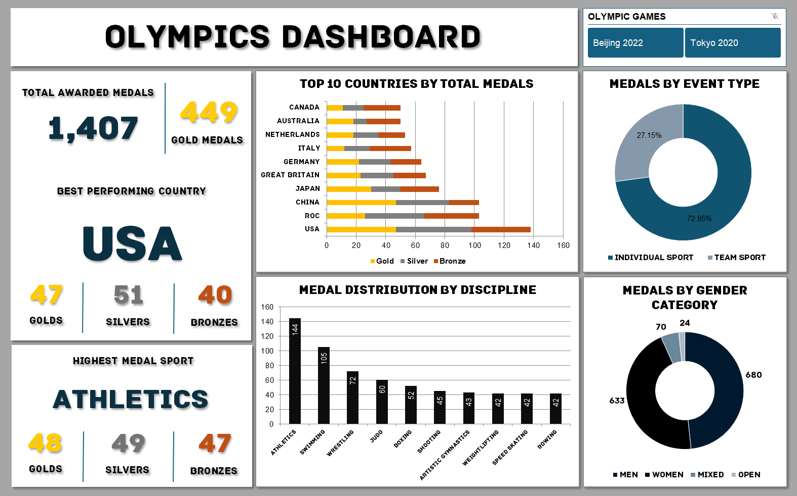

# 🏅 Olympics Performance Analysis & Dashboard

 

## 📌 Executive Summary
In the realm of global competitive sports, performance data holds the key to mapping athletic dominance and institutional success. This project analyzes multi-season Olympic Games data (Tokyo 2020 & Beijing 2022) to evaluate national medal counts, gender distribution, and sport-specific trends. The goal was to transform messy multi-sheet sports records into a highly polished, interactive dashboard that allows stakeholders to easily filter and explore what drives a nation's position on the podium.

---

## 🛠️ Data Processing & Methodology
To ensure precise mathematical tracking and smooth interactive visuals, the dataset was systematically cleaned, structured, and aggregated entirely within a single workbook ecosystem.

**1. Data Architecture & Preprocessing:**
* Consolidated records into two functional tracking sheets: `raw_data` and `olympic_medals`.
* Handled structural data disparities between different games (Winter vs. Summer) by standardizing nomenclature for countries, athlete tracking profiles, and country ISO codes.
* Categorized distinct athletic competitions into a clear binary grouping: **Individual Sports** vs. **Team Sports** to evaluate differences in team-size overhead versus solo athletic achievement.

**2. Metric Calculations & Backend Logic:**
* Constructed isolated backend working panels utilizing complex Pivot Tables to eliminate visual clutter on the final consumer-facing view.
* Calculated precise cumulative sums for distinct medal tiers (Gold, Silver, Bronze) along with grand total splits across sports categories and participating nations.

**3. Dashboard Architecture & Interface Design:**
* Designed an executive UI dashboard sheet optimized for instant scannability using stacked horizontal bar charts for clear country ranking, vertical bar charts for sports comparisons, and desaturated donut charts for component ratios.
* Deployed an interactive global **Olympic Games Filter Slicer** linked dynamically across all Pivot Tables, allowing users to seamlessly transition between specific insights for Tokyo 2020, Beijing 2022, or aggregated dual-season views.

---

## 📈 Key Performance Indicators (KPIs)

| Metric | Performance |
| :--- | :--- |
| 🏅 **Total Awarded Medals** | 1,407 |
| 🥇 **Total Gold Medals** | 449 |
| 🇺🇸 **Top Performing Country** | United States (138 Total Medals: 47 Gold, 51 Silver, 40 Bronze) |
| 🏃 **Highest Medal Discipline** | Athletics (144 Total Medals) |
| 👥 **Gender Distribution Split** | Men (680 Medals) \| Women (633 Medals) \| Mixed/Open (94 Medals) |

---

## 💡 Key Athletic Insights

| Focus Area | Key Finding | Insight / Trend |
| :--- | :--- | :--- |
| 🇺🇸 **Global Podium Dominance** | The **United States** secured the highest cumulative tally with 138 medals, leading over ROC (103) and China (103). | While the USA wins on sheer overall volume (Silver and Bronze depth), **China** ties the USA directly on raw gold-tier execution (47 Gold medals each), showcasing an ultra-efficient focus on gold-medal outcomes. |
| 🏃‍♂️ **High-Yield Sports Blocks** | **Athletics (144)** and **Swimming (105)** contribute a massive, disproportionate chunk of the total Olympic medal pool. | These two powerhouse disciplines present the most lucrative opportunities for national programs to accumulate massive medal volumes in a single Olympic cycle. |
| 👟 **Solo vs. Team Overheads** | Over **72.85%** of all medals are won within **Individual Sports**, leaving Team Sports at just 27.15%. | A country's position on the leaderboards heavily depends on training elite solo competitors rather than relying strictly on multi-athlete team fields, which carry higher logistical and operational overheads for a single medal asset. |
| ⚖️ **Gender Balancing** | Modern medal distribution is remarkably well-balanced, with **Men securing 680 medals** and **Women securing 633 medals**. | The minor variance is closing rapidly as international governing boards continue to add more dedicated women's divisions and mixed-gender relay events (70 medals) into the standard Olympic programming. |

---

## 🖥️ Dashboard Preview

---

## 📂 Repository Contents
* `olympics.xlsx`: The master interactive workbook containing the entire data architecture:
  * `raw_data` / `olympic_medals`: Structured source datasets detailing records and event flags.
  * `kpi_pivot_table` / `visualization_pivot_table`: Backend transformation engines feeding the metrics.
  * `Dashboard`: The interactive display grid equipped with stacked graphs, proportional charts, and linked slicers.
* `assets/`: Houses the high-resolution dashboard graphics used in the project documentation.